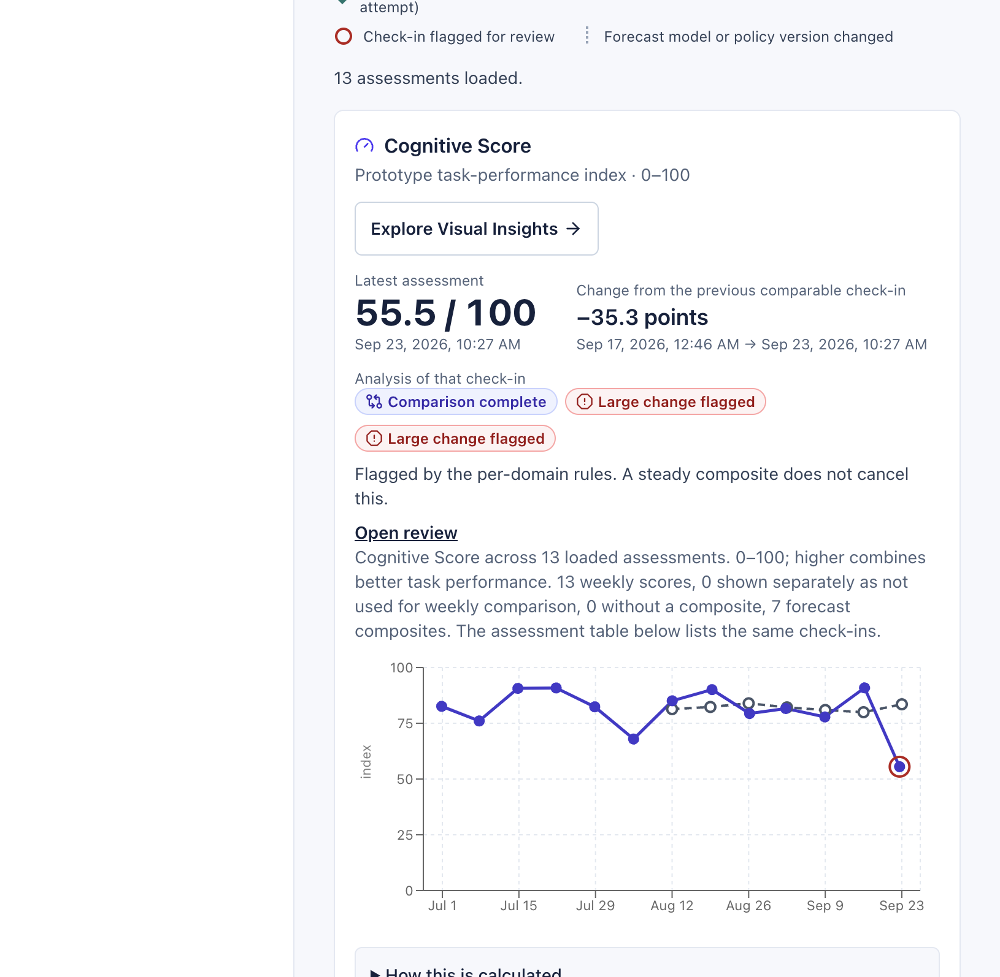
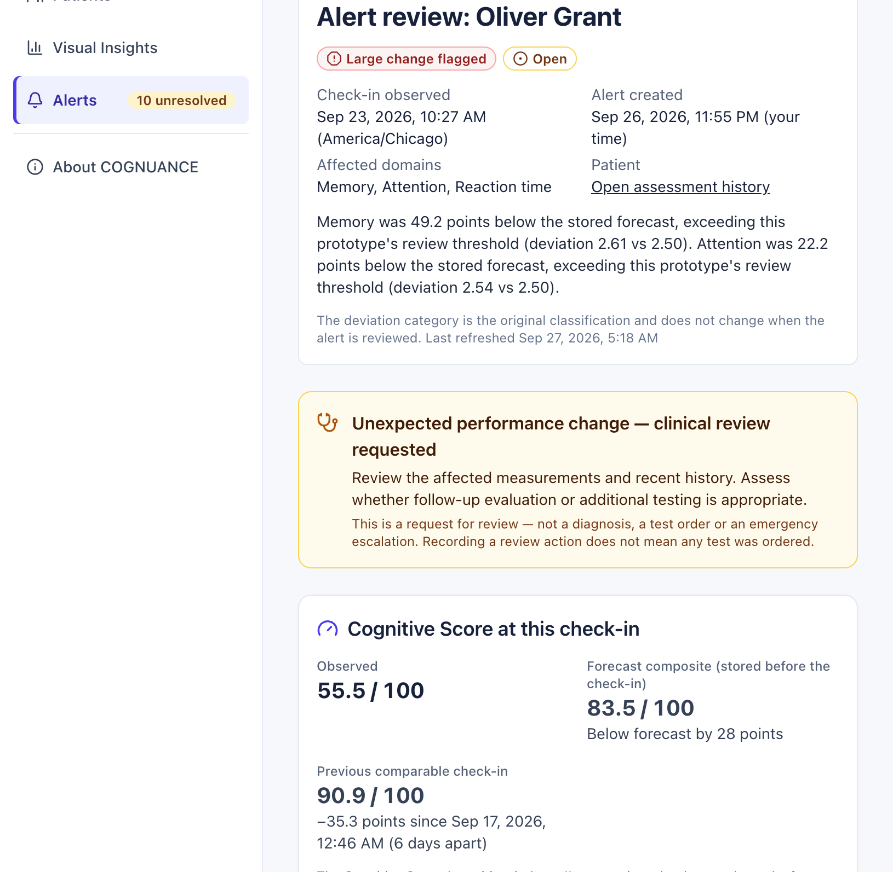
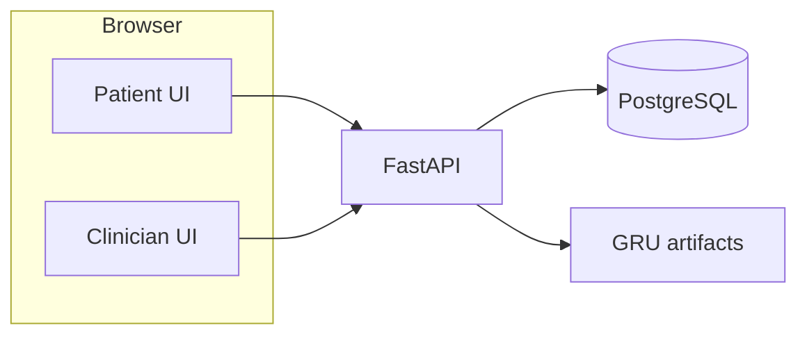

# COGNUANCE

Cognitive performance monitoring after an Alzheimer's diagnosis.

COGNUANCE brings short memory, attention, and reaction-time assessments together with personalized forecasts and a clinician dashboard. It tracks performance over time and flags unexpected worsening for review, helping clinicians assess whether follow-up evaluation or additional testing is appropriate.

Built for HackGT 13. This prototype uses synthetic patient records and has not been clinically validated.

## See the application



Cognitive Score sits above the memory, attention, and reaction-time charts on Assessment history. Observed values are solid; stored forecasts are dashed.



An assigned clinician sees what changed, the stored forecast, and a prompt to decide whether further evaluation is appropriate. Resolving an alert never hides the evidence.

## What it does

A patient completes a weekly browser check-in: word recall, a go/no-go shape task, a reaction-time task, and an optional sleep/mood/medication context form. The server recomputes every score. Patients never see scores, deviation levels, or clinician notes.

Each visit can show a display-only Cognitive Score (`cognitive_index_v1`) above the three domain charts. Visual Insights (`/doctor/insights`) is a separate tab over a complete bounded snapshot (heatmap, change bars, distribution, context scatter, quality, alert timeline, linked selection, two-visit compare).

A forecasting model issues next-visit predictions from the last six eligible weekly assessments. After submission, those stored predictions are compared with the new result. Qualifying worsening creates an in-app alert for the assigned clinician, who can acknowledge, add a note, or resolve it. Access is assignment-scoped (unassigned = 404). Forecast, assessment, analysis, and review events are retained and versioned.

Incomplete: scenario replay is not implemented. Public HTTPS needs a supplied domain. A full Playwright run, including live patient-to-alert handoff, has not been completed.

## From assessment to clinician review

At session start, the system uses the patient's previous six eligible weekly assessments to issue a forecast before new answers arrive. After submission, the backend validates and scores the assessment, then compares its domain results with that stored forecast. Qualifying worsening creates an in-app alert for the assigned clinician. The review screen shows what changed and the evidence behind the alert, prompting the clinician to assess whether further evaluation or testing is appropriate.

Notifications are in-app only: the dashboard polls about every 10 seconds while visible and refreshes on focus or reconnect. There is no email, push, instant delivery, automatic test order, or emergency monitoring service.

## Forecasting, anomaly detection, and Cognitive Score

**Forecasting.** The verified active engine is a GRU (`forecast-run-v1-gru`) with anomaly policy `policy-v1`. LAST_VALUE and LINEAR_TREND are trained as offline baselines; they are not the active runtime pair. Inputs are six prior eligible weekly assessments. Features include the three scores plus sleep, mood, and medication (with missingness masks). Outputs are predicted memory, attention, and reaction time. The API never trains; it loads a hash-verified artifact. Without a registered bundle, `GET /api/v1/model/status` reports `forecast_ready: false` and new sessions stay `MODEL_UNAVAILABLE`.

**Anomaly detection.** Only worsening-direction forecast errors count (lower memory/attention, slower reaction). A calibrated policy (threshold **r = 2.5** on standardized deviation) and a persistence streak decide REVIEW, PERSISTENT_DEVIATION, or HIGH_DEVIATION. Large differences request review; they do not identify a cause or diagnose progression. The model trains offline. Later forecasts may use new eligible history without online retraining.

**Cognitive Score.** Version `cognitive_index_v1` summarizes one visit. It does not trigger or suppress alerts.

```text
response_speed = 100 × clamp((3000 − reaction_time_ms) / 2900, 0, 1)
Cognitive Score = (memory_score + attention_score + response_speed) / 3
```

Weights and the 100/3000 ms anchors are prototype design choices, not clinical norms. Display is `NN.N / 100`, not a brain-health percentage. Missing or invalid required results yield an unavailable score, not zero. Sleep, mood, and medication never enter the arithmetic. An observed score can exist while forecasting is still building a baseline. Six observations are an engineering window, not a medically established minimum.

On synthetic `full-v1`, GRU validation patient-macro error was 0.470 vs 0.567 (linear trend) and 0.581 (last value). Held-out clean-target alert rate was 5.5% (slightly above the 5% target); 19 of 29 analyzable injected worsening events were detected. Synthetic engineering metrics only.

## Architecture and stack



Offline training (`generate_synthetic` → `train_forecasters` → `calibrate_policy` → `register_forecaster`) is a separate command sequence. Serving never trains on a request.

| Layer | Technology | Purpose |
| --- | --- | --- |
| Frontend | React 19, TypeScript, Vite 8, Tailwind 4, React Router 7, TanStack Query 5, Recharts 3 | Patient check-in, clinician dashboard, Visual Insights |
| Backend | FastAPI, Python 3.12, SQLAlchemy 2, Alembic, Pydantic 2 | Auth, scoring, forecasts, alerts, Insights API |
| Storage | PostgreSQL 17 | Identities, assessments, forecasts, analyses, alert events |
| ML | NumPy, pandas, scikit-learn, CPU PyTorch | Offline GRU + baselines; hash-verified serving |
| Local run | Docker Compose, uvicorn, Vite | Dev database and two-process app |
| Optional deploy | `compose.deploy.yaml`, Caddy 2, backend/frontend Dockerfiles | Same-origin `/api` proxy; public HTTPS needs a domain |

## Run locally

Primary path: clone, local Compose Postgres, backend on `:8000`, Vite on `:5173`.

1. Clone and enter the repository:

```bash
git clone https://github.com/Anshul0471/Cognuance-HackGT13.git
cd Cognuance-HackGT13
```

2. Install runtimes: Node.js 24 (see `.nvmrc`), npm, [uv](https://docs.astral.sh/uv/), Docker Desktop, and Python 3.12 (`uv python install 3.12`).

3. Copy the example env files and fill placeholders. Use the **same** random hex for `POSTGRES_PASSWORD` and the password inside `DATABASE_URL`. Generate values with `python3 -c "import secrets; print(secrets.token_hex(24))"`. Then `chmod 600 .env backend/.env`.

```bash
cp -n .env.example .env
cp -n backend/.env.example backend/.env
cp -n frontend/.env.example frontend/.env
```

| Setting | Where | Meaning |
| --- | --- | --- |
| `POSTGRES_PASSWORD` | `.env` | Local Compose database password |
| `DATABASE_URL` | `backend/.env` | SQLAlchemy URL; password must match Compose |
| `JWT_SECRET` | `backend/.env` | Signing key for access tokens (`iss=cognuance-api`, `aud=cognuance-web`) |
| `DEMO_ACCOUNT_PASSWORD` | `backend/.env` | Shared password for seeded `@demo.test` accounts (12+ characters) |
| `MODEL_MODE` | `backend/.env` | `unconfigured` until a bundle is activated; then `gru` |
| `VITE_API_BASE_URL` | `frontend/.env` | `/api/v1` (Vite proxies `/api` to `API_PROXY_TARGET`) |

4. Start PostgreSQL and apply migrations (never auto-run at API startup):

```bash
docker compose up -d db
cd backend
uv sync --locked --extra ml
uv run --extra ml alembic upgrade head
```

5. Model artifacts are not in git (~15 MB GRU bundle). Either train and register locally, or copy a verified `forecast-run-v1-gru` directory into `backend/artifacts/` and run `register_forecaster` / `activate_forecaster`. Until then the API starts, but forecasts are unavailable.

```bash
# After synthetic datasets exist (full-v1):
uv run --extra ml python -m app.scripts.train_forecasters --dataset-id full-v1 --run-id forecast-run-v1
uv run --extra ml python -m app.scripts.select_forecaster --run-id forecast-run-v1
uv run --extra ml python -m app.scripts.calibrate_policy --run-id forecast-run-v1 --policy-version policy-v1
uv run --extra ml python -m app.scripts.register_forecaster --run-id forecast-run-v1
uv run --extra ml python -m app.scripts.activate_forecaster --model-version forecast-run-v1-gru --policy-version policy-v1
```

Set `MODEL_MODE=gru` and restart the API. `GET /api/v1/model/status` must show `forecast_ready: true`.

6. Provision fictional accounts. `seed_demo` stores only password hashes; plaintext is your `DEMO_ACCOUNT_PASSWORD`. Optional showcase histories write extra credentials under `backend/data/showcase-private/` (git-ignored).

```bash
uv run python -m app.scripts.seed_demo
# Optional 30-patient presentation set (needs an active model and a presenter doctor UUID):
# uv run python -m app.scripts.prepare_showcase --dataset-id showcase-v1 --seed 20260927 \
#   --as-of 2026-09-26T16:00:00Z --presentation-at 2026-09-27T16:00:00Z \
#   --presenter-doctor-id <doctor-user-uuid>
# uv run --extra ml python -m app.scripts.import_showcase --dataset-id showcase-v1
```

Seeded demo accounts (password = `DEMO_ACCOUNT_PASSWORD`):

| Email | Role |
| --- | --- |
| `dr.rivera@demo.test` | Doctor (Eleanor, Walter, Rosa, Henry) |
| `dr.okafor@demo.test` | Doctor (Iris; showcase presenter when imported) |
| `eleanor.park@demo.test` | Patient |
| `walter.hughes@demo.test` | Patient |
| `rosa.delgado@demo.test` | Patient |
| `henry.lin@demo.test` | Patient |
| `iris.novak@demo.test` | Patient (other doctor) |

7. Start the app (one API worker — the login limiter and model cache are per process):

```bash
# backend/
uv run --extra ml uvicorn app.main:app --reload --host 127.0.0.1 --port 8000
# frontend/
cd ../frontend && npm ci && npm run dev -- --host 127.0.0.1
```

Open http://127.0.0.1:5173 (landing), http://127.0.0.1:5173/login, http://127.0.0.1:5173/status. API: http://127.0.0.1:8000. Docs UI is on in development (`/docs`). The access token lives only in memory; a reload signs you out. Stop with Ctrl+C and `docker compose stop db`. Do not run `docker compose down -v`.

An optional container path (`compose.deploy.yaml` + Caddy) was verified locally on HTTP. It is not required for development.

## Verification and limitations

Observed on this machine (isolated test database; not the demo DB):

| Check | Result |
| --- | --- |
| `cd backend && uv run --extra ml pytest` | 214 passed (unit + integration) |
| `cd backend && uv run ruff check . && uv run ruff format --check .` | clean |
| `cd frontend && npm run lint && npm run typecheck && npm run test` | 77 Vitest tests passed |
| `cd frontend && npm run build` | production build OK |
| Playwright `npx playwright test` (full suite) | NOT RUN as one job; individual journeys passed; patient-to-alert browser handoff incomplete |
| Public HTTPS release | BLOCKED (no host/domain) |

All people and histories are fictional. Tasks are custom prototypes, not MMSE/MoCA. Thresholds are engineering parameters. Clinicians interpret alerts; the software does not diagnose, order tests, or claim improved outcomes.

## Team and attribution

Built at HackGT 13 by [Anshul Manekar](https://github.com/Anshul0471) and [het1406](https://github.com/het1406). No project license has been adopted; third-party packages keep their own terms (see lockfiles). Demo names are fictional.

The OpenAPI contract exported from the running app lives at `backend/openapi.json` (22 operations, `backend_contract_v1`).
